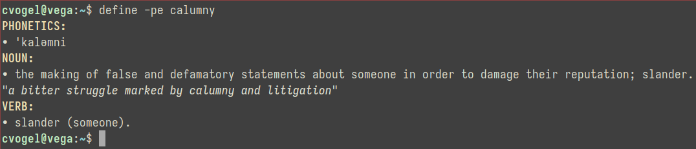

# Overview

A significant proportion of my computing time is spent in the terminal emulator
program. Often enough, I find myself requiring the services of a dictionary,
for which I must temporarily abandon the comfortable familiarity of the shell
for the browser, the app, or even the book.

I thought to myself: "*how convenient it would be to have a shell command for
fetching definitions*". Never wasting an opportunity to reinvent the wheel,
I eschewed the package manager and immediately undertook the writing of such
a program.

This repository contains the result of those efforts: a command-line utility
for looking up the definitions of words, with support for etymologies,
phonetics, and examplary usages.

# Methodology

The program utilizes the Merriam Webster free dictionary API service, which,
at the time of writing, will fulfill up to 1000 requests per day without
registration of any kind. Responses are provided in JSON, making Javascript
and node.js natural choices for language and execution environment.

The benefit of using such a service is the alleviation of the requirement to
maintain a dictionary of one's own. Having access to the productions of such
a respected institution is no small boon. Still, it may be necessary at some
future date to introduce an alternative solution which does not rely upon
external services in order to function. Let us cross that bridge when we get
there.

# Installation

The only dependency, apart from the shell itself, is node.js version 12.x or
greater. If your system has package management facilities, it is very likely
that a relevant package exists within the official repositories. Otherwise,
a copy may be acquired directly from https://nodejs.org.

Create a file called `define` with the content shown below, replacing all
instances of the string `REPO_PATH` with the path to the cloned repository.
```sh
#!/bin/sh
exec node REPO_PATH/define.js $*
```
Ensure that the above script and the node executable are in the system path.

# Usage

Invoke the script from any directory with the command `define`, e.g.,



In the above example, the command-line options `-pe` instruct the output to
include phonetic descriptions and usage examples for the different parts of
speech. By default, only the definitions are included. To obtain a complete
list of such options, type `define --help`.
